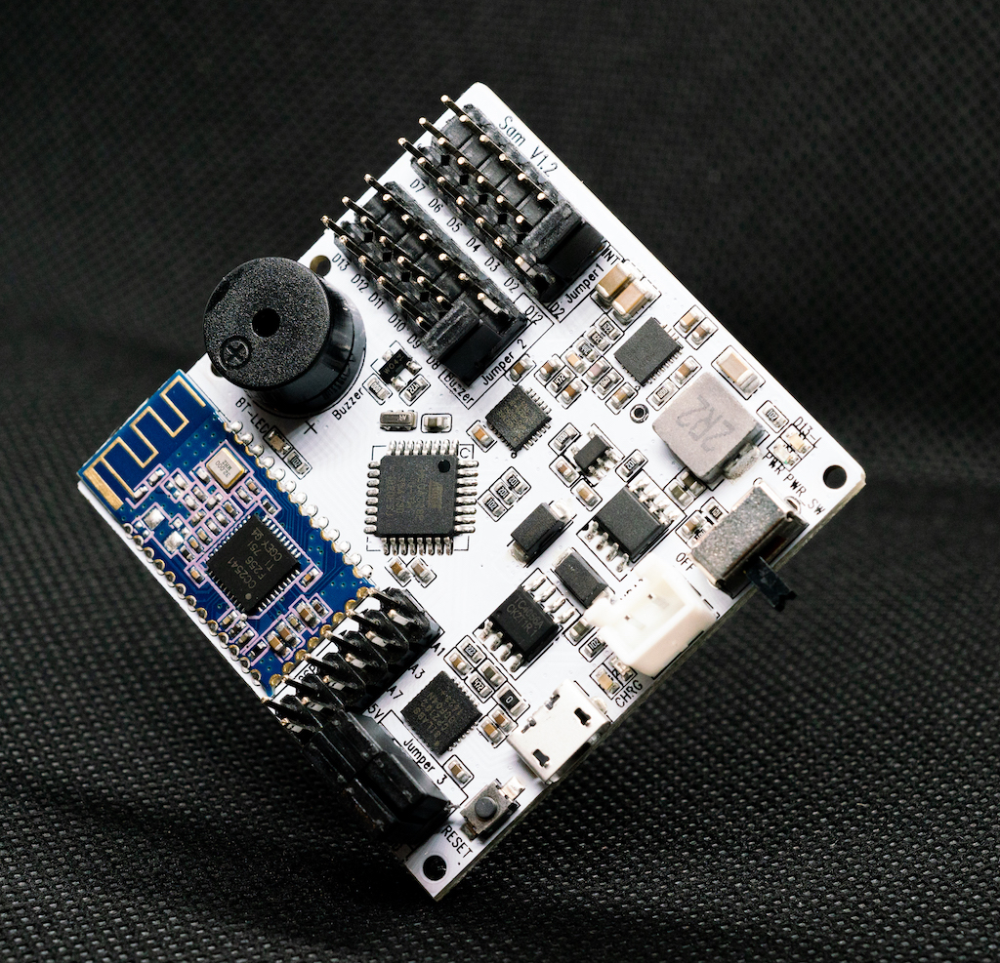

# SAM01 - Arduino Compatible Robotics Board for Makers and STEM Education

SAM01 is built for projects which need to work with the mobile app, servos motion tracking in mind.  With onboard Bluetooth Low Energy module, it is compatible with both Android and iOS.

It is ideal for building your own Bluetooth control robot, R/C car with motion tracking, Fitness Tracker, Vehicle Monitor, Home automation and much more.

## Specification
- Microcontroller:	ATmega328
- Bootloader: Arduino Nano
- Battery Input:	3.7-4.1V
- Battery Charger:	Lithium-Ion, 3.7V
- Bluetooth:		BLE - TI CC2541
- Buzzer:		Built-in
- MotionTracking:	MPU-6050 Six-Axis (Gyro + Accelerometer)
- USB-Serial:		Silicon CP2112
- Digital I/O Pins:	12
- Analog I/O Pins:	6
- PCB Size:		50 x 50 mm

## PIN Allocation
- D2:	MPU INT (Jumper 1)
- A4:	SDA - MPU
- A5:	SCL - MPU
- D9:	BLE TX
- D10:	BLE RX
- D12:	Buzzer (Jumper 2)
- D13: 	LED

## Resources
- Github: 
http://github.com/wombatics/sam01
- USB-Serial Driver: 
http://bit.ly/cp2112-usb-serial
